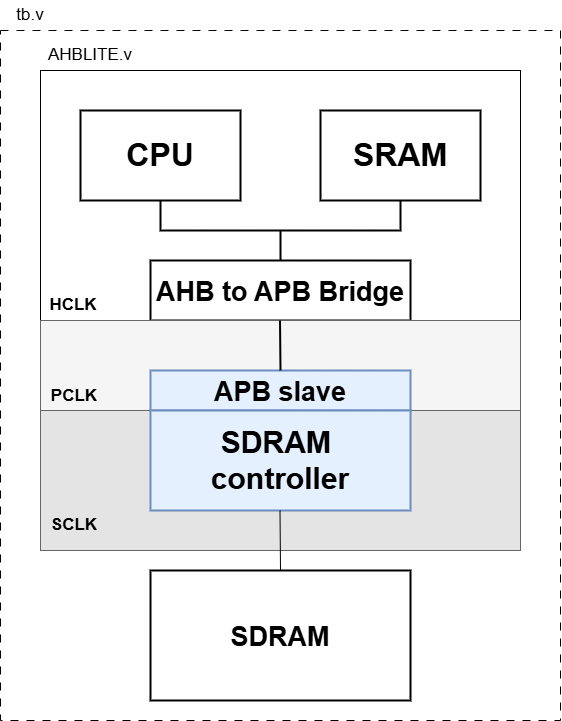
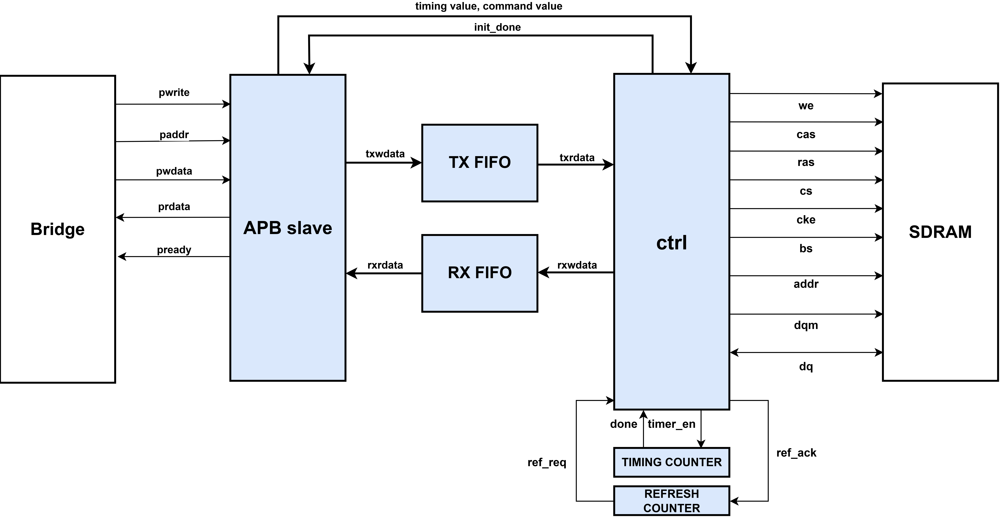

# SDRAM Controller
---

SDRAM : Winbond SDRAM W9825G6KH

CPU : ARM Cortex M0

---
**[Used Command]**
- Bank active
- Bank precharge
- precharge all
- write
- read
- mode register set
- no-operation
- device deselect
- Auto-refresh

**[Feature]**
- 32bit AHB data to 16bit SDRAM
- HCLK,PCLK,SCLK CDC
- suppport grade6
    - clk: 133MHz, 166MHz
    - CL(Cas Latency) : 2,3,
    - BL (burst length) : 1,2,4,8

**[Top Architecture]**
      

  

  

**[Block Diagram]**
      

  

  

**[State Diagram]**
      

  

  

